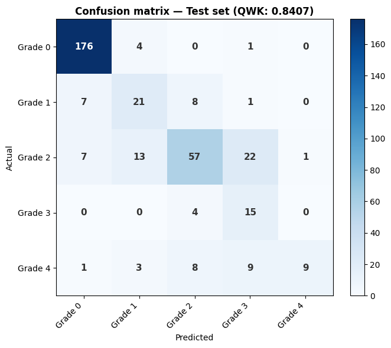
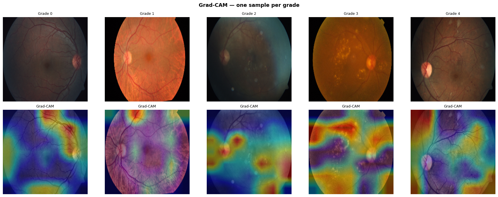
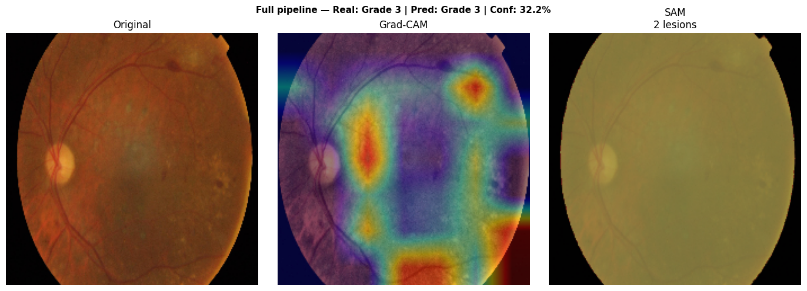
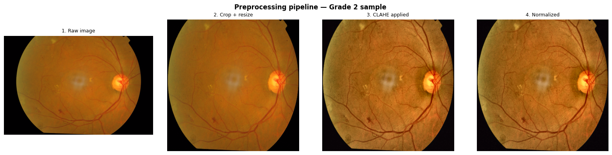

# Retina-scan

A deep learning system for diabetic retinopathy detection from retinal fundus photographs. The system classifies retinal images into 5 severity grades, explains its predictions with Grad-CAM heatmaps, and segments individual lesions using Meta's Segment Anything Model (SAM).

Built as a production-ready Python package: modular, tested, and deployable via a REST API.

---

## Results

| Metric | Value |
|--------|-------|
| Quadratic Weighted Kappa | **0.8209** |
| Architecture | EfficientNet-B0 |
| Training strategy | Two-phase fine-tuning |
| Dataset | APTOS 2019 (3,662 images) |

Quadratic Weighted Kappa penalizes large misclassifications more than small ones: a grade 4 predicted as grade 0 costs far more than a grade 1 predicted as grade 2. A score of 0.82 puts this in the "excellent concordance" range, comparable to agreement between two ophthalmologists reviewing the same images independently.



---

## What it does

**Classification**: EfficientNet-B0 fine-tuned on retinal fundus photographs predicts one of five diabetic retinopathy grades:

| Grade | Label | Description |
|-------|-------|-------------|
| 0 | No DR | Healthy retina |
| 1 | Mild | Microaneurysms only |
| 2 | Moderate | Hemorrhages and hard exudates |
| 3 | Severe | Hemorrhages in all four quadrants |
| 4 | Proliferative | Neovascularization: emergency |

**Explainability**: Grad-CAM generates a heatmap over the original image showing which regions drove the prediction. In a clinical setting this allows a general practitioner to verify that the model is looking at actual lesions and not camera artifacts or image borders.



**Segmentation**: SAM (Segment Anything Model) uses the Grad-CAM activation peaks as prompts to produce pixel-precise masks of each detected lesion. The output includes lesion count and total affected area in pixels.

**API**: FastAPI serves the complete pipeline as a REST endpoint. Any application can send a retinal image and receive a JSON response with grade, confidence, heatmap path, and lesion statistics.



---

## Architecture

The project is organized as a modular Python package. Each module has a single responsibility and a corresponding test file.

```
retina-scan/
├── preprocessing.py      # CLAHE in LAB colorspace, crop, resize, normalize
├── augmentation.py       # Medical-safe augmentation with albumentations
├── dataset.py            # RetinaDataset, stratified splits, class weight computation
├── model.py              # EfficientNet-B0/B4 with custom classification head
├── trainer.py            # Two-phase training loop, early stopping, checkpointing
├── metrics.py            # Quadratic weighted kappa, confusion matrix, per-class sensitivity
├── explainability.py     # Grad-CAM via PyTorch hooks
├── segmentation.py       # SAM lesion segmentation using Grad-CAM prompts
├── api.py                # FastAPI REST endpoint
├── train.py              # Training entry point
├── tests/                # pytest suite for all modules
└── notebooks/
    └── demo_end_to_end.ipynb
```

### Preprocessing pipeline

Raw retinal images arrive with uneven illumination (bright center, dark edges) and low contrast between lesions and the reddish background. The pipeline addresses both before the image reaches the model:

1. **Crop black border**: removes the circular black mask that fundus cameras produce
2. **Resize**: cubic interpolation to target size (224 for B0, 380 for B4)
3. **CLAHE**: applied in LAB colorspace, only to the L (luminance) channel. This improves contrast uniformly without distorting the diagnostic color information: yellow exudates and red hemorrhages remain visually distinct
4. **Normalize**: ImageNet mean and std, required for pretrained EfficientNet weights


### Class imbalance handling

The APTOS dataset is heavily imbalanced: grade 0 (healthy) has 1,805 images while grade 3 (severe) has only 193. Two complementary mechanisms address this:

- **Weighted CrossEntropyLoss**: each class is assigned a weight inversely proportional to its frequency. Errors on rare classes (grade 3: 193 images) generate larger gradients than errors on common classes (grade 0: 1,805 images)

### Transfer learning strategy

EfficientNet-B0 was pretrained on ImageNet. Training proceeds in two phases:

**Phase 1 (3 epochs)**: only the classification head is trained. Learning rate: 1e-3. The backbone remains frozen: this prevents the ImageNet weights from being destroyed before the new head has learned a useful signal.

**Phase 2 (7 epochs)**: full model fine-tuning with a lower learning rate (1e-4). CosineAnnealingLR gradually reduces the learning rate across the phase. Early stopping with patience 3 monitors validation kappa and saves the best checkpoint.

### Grad-CAM implementation

Grad-CAM uses PyTorch hooks to capture the feature maps and gradients of the last convolutional layer without modifying the model. For a given prediction:

1. A forward hook saves the feature maps of `model.features[-1]`
2. The gradient of the predicted class score is backpropagated to those feature maps
3. Each feature map is weighted by the global average of its gradients
4. The weighted sum is passed through ReLU and upsampled to the input image size

The result is a heatmap where high values indicate the regions that most influenced the prediction. Hooks are removed after each call to prevent memory leaks.

### SAM segmentation

SAM (ViT-B variant) receives the top-k activation points from the Grad-CAM heatmap as point prompts. SAM was trained on 11 million images with 1.1 billion masks and can segment arbitrary objects without domain-specific retraining. In this context it delimits each lesion region to pixel precision given the approximate location from Grad-CAM.

The two-step pipeline: Grad-CAM for localization, SAM for segmentation: avoids the need for pixel-level annotation of retinal lesions during training, which would require hours of ophthalmologist time per image.

---

## Tech stack

| Layer | Tools |
|-------|-------|
| Deep learning | PyTorch, torchvision, EfficientNet |
| Image processing | OpenCV, albumentations, PIL |
| Segmentation | Segment Anything Model (SAM ViT-B) |
| Metrics | scikit-learn (cohen_kappa_score) |
| API | FastAPI, uvicorn |
| Testing | pytest |
| Data | APTOS 2019 Blindness Detection (Kaggle) |

---

## Setup

### Requirements

```bash
pip install -r requirements.txt
```

### SAM weights

```bash
wget https://dl.fbaipublicfiles.com/segment_anything/sam_vit_b_01ec64.pth
```

### Dataset

Download the APTOS 2019 dataset from Kaggle:

```bash
kaggle competitions download -c aptos2019-blindness-detection
unzip -q aptos2019-blindness-detection.zip -d data/
```

Or download directly from: https://www.kaggle.com/competitions/aptos2019-blindness-detection

---

## Training

```bash
python train.py
```

Default configuration uses EfficientNet-B0, image size 224, batch size 4: suitable for CPU training. Expected training time: ~2 hours on a 4-thread CPU. For GPU training with EfficientNet-B4 and image size 380, modify `TrainerConfig` in `train.py`.

Training output:

```
Train: 2929 images | Val: 733 images
Phase 1: Classifier only (3 epochs)
  Epoch 1/3 | Train Loss: 1.3436 | Val Loss: 1.1765 | Val QWK: 0.7688
  ...
Phase 2: Full fine-tuning (7 epochs)
  ...
  Epoch 7/7 | Train Loss: 1.0578 | Val Loss: 0.8715 | Val QWK: 0.8209
Best val QWK: 0.8209
```

The best checkpoint is saved to `checkpoints/best_model.pt`.

---

## Running the API

```bash
uvicorn api:app --reload --port 8000
```

Interactive documentation available at `http://localhost:8000/docs`

### Predict endpoint

```bash
curl -X POST "http://localhost:8000/predict" \
     -F "file=@retina.png"
```

Response:

```json
{
  "predicted_class": 3,
  "class_name": "Severe",
  "clinical_note": "Severe diabetic retinopathy. Urgent referral required.",
  "confidence": 0.61,
  "probabilities": [0.02, 0.04, 0.12, 0.61, 0.21],
  "referral_recommended": true
}
```

### Health check

```bash
curl http://localhost:8000/health
# {"status": "ok"}
```

---

## Tests

```bash
pytest tests/ -v
```

Tests cover all modules including preprocessing pipeline behavior, augmentation constraints, dataset splits and class distribution, model output shape and dtype, metric correctness (kappa, confusion matrix, sensitivity), Grad-CAM hook registration and cleanup, SAM mask generation, and API endpoint responses.

---

## Demo notebook

`notebooks/demo_end_to_end.ipynb` walks through the complete system:

1. Dataset exploration and class distribution
2. Preprocessing pipeline: visual comparison of each step
3. Model performance on the test split: confusion matrix and per-class sensitivity
4. Grad-CAM visualizations for all five grades
5. Full pipeline on a single image: classify, localize, segment

---

## Design decisions

**Why CLAHE in LAB colorspace and not RGB**: applying CLAHE directly to RGB channels independently would shift the hue of lesions. Yellow exudates and red hemorrhages have diagnostic meaning: their color should not be altered by preprocessing. Operating only on the L (luminance) channel improves contrast without touching color information.

**Why weighted sampler and weighted loss together**: they address the class imbalance problem at different points. The sampler controls exposure frequency: the model sees rare classes more often. The loss controls gradient magnitude: mistakes on rare classes generate larger updates. One without the other leaves a residual imbalance.

**Why two-phase training**: if you unfreeze the full backbone immediately with a high learning rate, the large gradients from the randomly initialized head will corrupt the ImageNet weights in the first few batches. Phase 1 trains only the head until it produces a useful signal, then Phase 2 fine-tunes the full network with a conservative learning rate.

**Why Grad-CAM before SAM**: training a segmentation model on retinal images requires pixel-level annotations, which means an ophthalmologist manually drawing lesion boundaries on thousands of images. The Grad-CAM → SAM pipeline avoids this entirely: Grad-CAM localizes approximate regions using only the classification labels already available, and SAM handles precise segmentation without any domain-specific training.

**Why QWK and not accuracy**: with a heavily imbalanced dataset, a model that always predicts grade 0 achieves ~49% accuracy but is clinically useless. QWK penalizes large misclassifications more than small ones and accounts for the ordinal structure of the grades. It is also the official metric for the APTOS Kaggle competition.

---

## Limitations

- Trained on APTOS 2019, which consists of images from Indian clinics. Performance on retinal images from Colombian or other Latin American equipment may differ and would benefit from fine-tuning on locally collected data.
- EfficientNet-B0 was used for CPU compatibility. B4 with GPU training would improve kappa further.
- Grade 1 and grade 3 have lower per-class sensitivity due to fewer training examples and more ambiguous visual boundaries. These are also the grades where ophthalmologists themselves show higher inter-rater variability.
- SAM segmentation quality depends on Grad-CAM localization quality. For very small microaneurysms (grade 1), the activation peaks may not be precise enough for reliable segmentation prompts.
